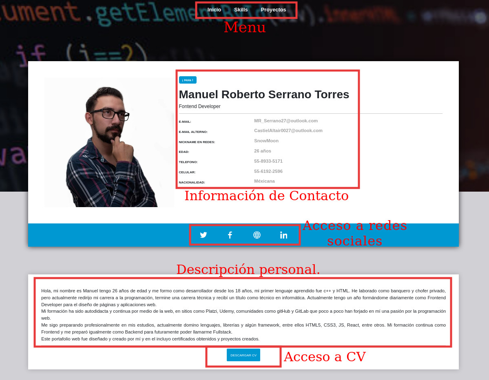
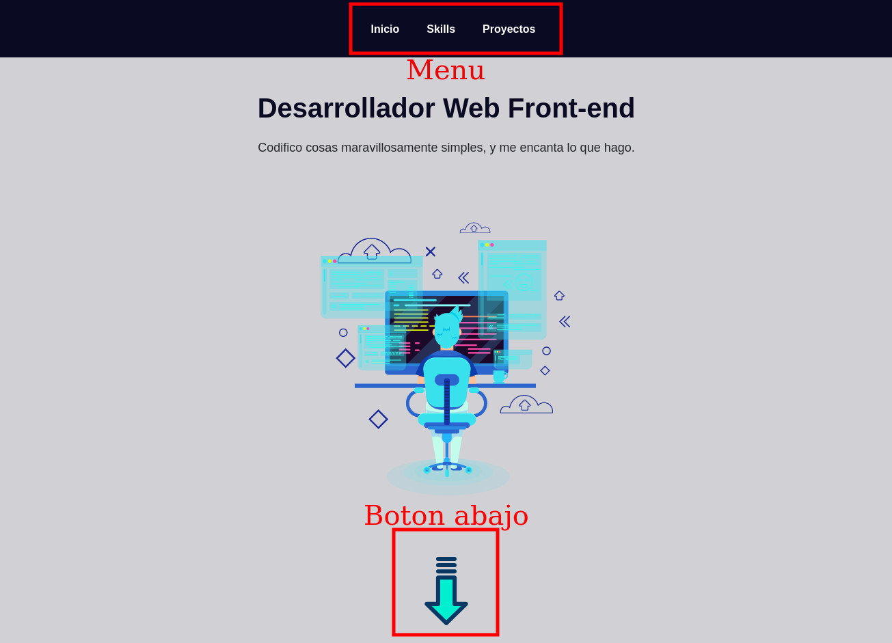
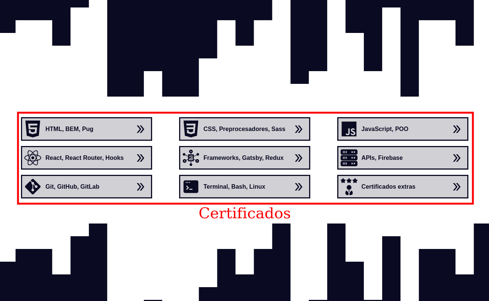
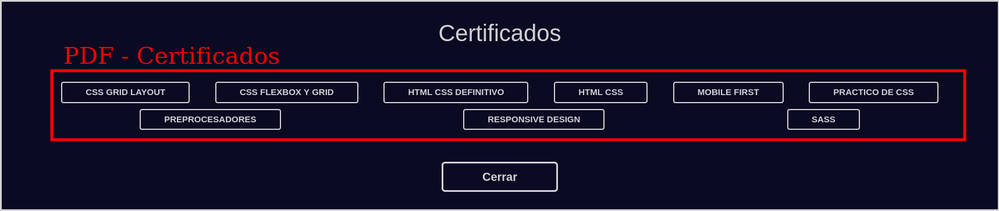
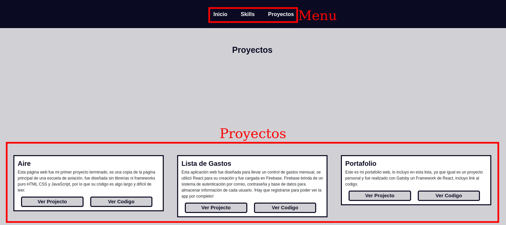

<!-- AUTO-GENERATED-CONTENT:START (STARTER) -->

  

<h1 align="center">
  Portafolio Web - Manuel Roberto Serrano Torres
</h1>

Este portafolio web fue realizado por mí utilizando tecnologías como <a href="https://www.gatsbyjs.com/" target="_blanck">Gatsby</a> que es un framework basado en React el cual facilita la creación de páginas web estáticas.

## 🚀 Portafolio

1.  **Pagina Principal.**

En esta página se da información personal, para contactarme en caso de requerirlo,acceso a mis redes y doy una breve información mía. Se incluye un link a mi CV

2.  **Skills.**

En esta página incluí mis certificados obtenidos, a lo largo de mi formación como desarrollador web. Se encuentran separados por secciones y cada sección tiene acceso al certificado en PDF para su revisión.

3.  **Proyectos**

Esta sección incluye una miniatura de la vista principal de cada proyecto que he creado, junto con un link que da acceso al proyecto en sí y otro que da acceso a su código en GitHub, se agrega de igual forma una breve descripción de cada proyecto.

## 🚀 Quick start (Gatsby Cloud)

<!--  -->

## 🧐 What's inside?

Proyecto creado por SnowMoon
